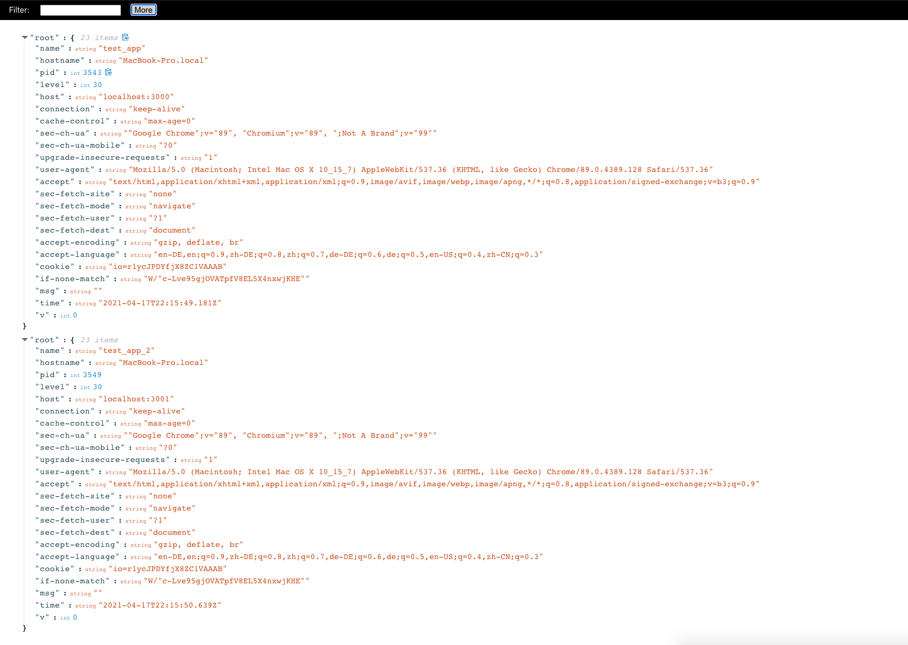

# What is flex-log
Flex-log is a server running on top of the original server you have. It collects all the logs for different servers you run with flex-log and provide a central UI to display all logs in same page. It also provides some features to help you focus on the log line you are interested in.

The UI of flex-log is quite simple right now. It can be much nice based on the feature requests.

In this example, the logs from two independent NodeJS servers "test_app" and "test_app_2" running under different ports 3000 and 3001 flow to same place and displayed next to each other.

# Goal
The goal of this project to is provide a flexible way to consume logs for NodeJS local development.

When developing the apps for NodeJS, it is common that the target information in the log you want to see is lost in tons of logs generate by server, e.g. the logs for incoming request. The situation can be much more complicated in the context of `micro-service` architecture that you need to run `3-10` different servers locally.

With flex-log, developers can aggregate all the logs into single place and then filter/transform it to a subset of information that you need. The logs flow through flex-log is served only for display purpose without affecting the original format that will be stored in production environment. 

# Features
There are two main features of flex-log:
- string filter against logs
- logs transformation
## string filter
The string filter is simply using the filter input box at top-left corner of the page to input any string and the logs will be filtered based on what you input

In the example, only logs from `app_2` will be kept.
## Log transformation
The log transformation functionality is the most powerful feature flex-log provides right now. In most cases, the logs are always verbose that actually brings difficulty during the development. The log transformation can help you simplify what you see.

In this example, you can see the test server outputs the whole request header to the log server. It is very verbose and complicated. As a developer, if I am only interested into some pieces of information inside logs, I can use the `More` button to bring up the `Log transformation` area, inside this log transformation area, I can input the target JSON format I want to see. Pay attention here, the whole log line is an object called `log`. I can access the host by `log.host`. In the target format, I can do string concatenation like appending `_2` to the original host, or create new Date object by call `new Date` on `log.time`. You can do any JSON transformation as you did in the source code. The red rectangle shows the final log after apply the transformation. 

# How to use flex-log
The usage is as simple as `fl -p ${PORT} server.js` with the `-p` or `--port` to specify the UI of the log center. For example, 
`fl -p 9000 server.js` will run log center UI on port `9000` and `node server.js` as it is. The original server will still be served based on the configuration in your server, e.g. 3000.

# Installation
`npm i @xuejie-yu/flex-log`

# How to test it
A test server is provided under the repository (https://github.com/xuejie-yu/flex-log-test-server). You can clone it and use it to test the `flex-log`.
